# VirtualBox Lab (Windows Host): 2 Ubuntu VMs + Internet + Same Network + Host SSH

Goal:
- Install **VirtualBox** on Windows
- Create **two Ubuntu VMs** (latest stable LTS recommended)
- Ensure:
  - Both VMs have **internet**
  - VMs can **communicate with each other**
  - Windows host can **ping + SSH** into each VM

## Recommended network design (stable for classrooms)

Use **two network adapters per VM**:

1. **Adapter 1: NAT Network**
   - Provides internet access
   - Allows VM-to-VM on the NAT network

2. **Adapter 2: Host-Only Adapter**
   - Provides a private network between Windows host and VMs
   - Best for SSH from Windows to the VMs (and also VM-to-VM)

We will use the **Host-Only IPs** for:
- SSH from Windows
- Ansible inventory (later)

### Why two adapters? (theory)

- **NAT Network** gives outbound internet for package updates and downloads.
- **Host-Only** gives a stable private subnet between host and VMs for SSH and automation.
- Using both avoids common classroom issues where internet works but host-to-VM SSH fails.

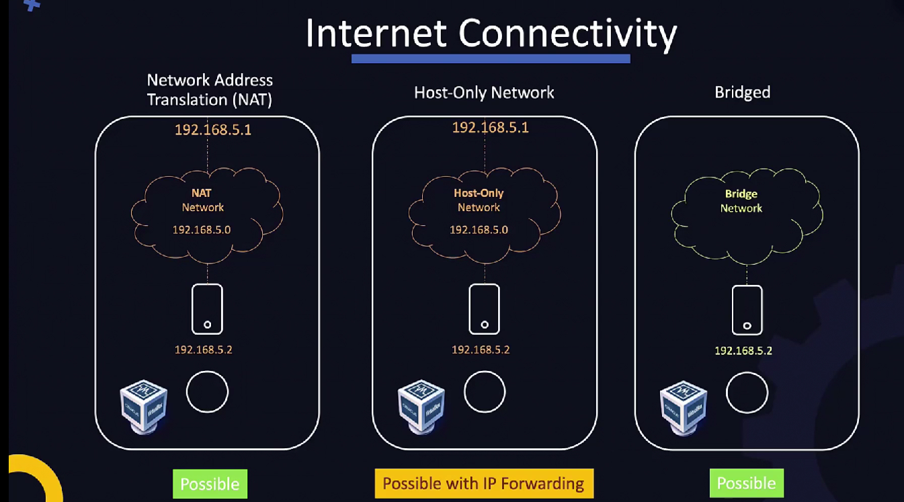
*Photo credit: KodeKloud Ltd.*

### Networking modes overview (theory)

#### NAT (Network Address Translation)

- 🔍 What it is
  - VM is placed behind a VirtualBox NAT on a private subnet (e.g., `10.0.2.0/24` internally, or similar)
  - VirtualBox acts as a router performing address/port translation
  - Default route points to the VirtualBox NAT device
- 👉 Traffic flow
  - VM → VirtualBox NAT → Host uplink → Internet
- ✅ Key characteristics
  - Outbound internet: ✅ works by default
  - Host → VM: ❌ not directly (requires port forwarding)
  - VM ↔ VM: ❌ isolated in simple NAT (no L2 between VMs)
- 🎯 When to use
  - Package installs (`apt`, `docker pull`), general web access from the VM
  - You do not need inbound connectivity from host or other VMs
- 👉 Examples
  - Installing Kubernetes/DevOps tooling, pulling container images
- ⚠️ Limitations
  - Cannot SSH from host without explicit port forwarding rules
  - Not suitable for multi-node cluster east–west communication

#### Host-Only Network

- 🔍 What it is
  - Creates a private network between Host ↔ VM(s); no internet by default
  - Example subnet: `192.168.56.0/24` (host adapter often `192.168.56.1`)
- 👉 Communication
  - Host ↔ VM: ✅
  - VM ↔ VM: ✅ (on same host-only network)
  - VM → Internet: ❌ unless you add a second adapter (e.g., NAT/NAT Network) or configure routing/NAT on the host
- ✅ Key characteristics
  - Fully isolated lab network, stable addressing
  - Safe for demos; no exposure to the external LAN
- 🎯 When to use
  - Clusters (control-plane + workers), DB + app testing, internal-only labs
- 👉 Example (this guide)
  - `ubuntu-1`: `192.168.56.101`, `ubuntu-2`: `192.168.56.102`
- ⚠️ Limitations
  - No internet without a second adapter; typical solution: dual NICs (Host-Only + NAT/NAT Network)

#### Bridged Network

- 🔍 What it is
  - VM connects directly to the physical LAN like a separate machine
  - Gets an IP from your real router/DHCP (same L2 as your laptop/host)
- 👉 Example
  - Laptop: `192.168.1.5`, VM: `192.168.1.20`, Router: `192.168.1.1`
- ✅ Key characteristics
  - VM is first-class on the LAN; discoverable/reachable by other LAN devices
  - Good for demos where phones/tablets/other PCs must reach the VM
- 🎯 When to use
  - Web/API server access from real network devices; realistic LAN testing
- 👉 Example
  - Access Node.js app in VM from mobile on same Wi‑Fi
- ⚠️ Limitations
  - Security: VM is exposed on the LAN
  - May be blocked on corporate/WPA‑Enterprise/wifi isolation networks

#### NAT Network (Advanced NAT)

- 🔍 What it is
  - Like NAT for internet egress, but VMs share a private subnet and can talk to each other
  - DHCP can auto-assign addresses on that private segment
- 👉 Communication
  - VM ↔ VM: ✅ (on the NAT Network segment)
  - VM → Internet: ✅
  - Host → VM: ❌ direct (use Host-Only or port forwarding if needed)
- 🎯 When to use
  - Multi-VM labs needing both east–west (VM↔VM) traffic and internet access
  - Lightweight clusters where host access is not required (or is via Host-Only)

#### Final comparison (cheatsheet)

| Feature                | NAT | Host-Only | Bridged | NAT Network |
|------------------------|:---:|:---------:|:-------:|:-----------:|
| Internet               | ✅  | ❌        | ✅      | ✅          |
| Host → VM              | ❌  | ✅        | ✅      | ❌ (pfwd)   |
| VM ↔ VM (same host)    | ❌  | ✅        | ✅      | ✅          |
| Real LAN visibility    | ❌  | ❌        | ✅      | ❌          |
| Best use               | Internet-only | Lab/cluster | Real exposure | Multi-VM + internet |

## IP plan (example)

Host-Only network: `192.168.56.0/24`

- Windows host adapter (VirtualBox Host-Only): `192.168.56.1`
- VM1 (ubuntu-1): `192.168.56.101`
- VM2 (ubuntu-2): `192.168.56.102`

> You can change the subnet if your PC already uses `192.168.56.0/24`.

## Part A — Install VirtualBox

1. Download **Oracle VirtualBox** for Windows:
   - Search “VirtualBox downloads” and download the latest stable release.
2. Install VirtualBox with default options.
3. (Recommended) Install **VirtualBox Extension Pack** that matches your VirtualBox version.

## Part B — Create network objects in VirtualBox

### Step B1: Create a NAT Network

1. Open VirtualBox → **Tools** → **Network**
2. Go to **NAT Networks**
3. Click **Create**
4. Name: `LabNAT`
5. IPv4 Prefix (example): `10.10.10.0/24`
6. Ensure **DHCP** is enabled
7. Save

Theory:
- In a NAT Network, VMs sit on a private subnet behind VirtualBox NAT.
- Outbound traffic works immediately; inbound access from host typically needs separate host-only access or port forwarding.

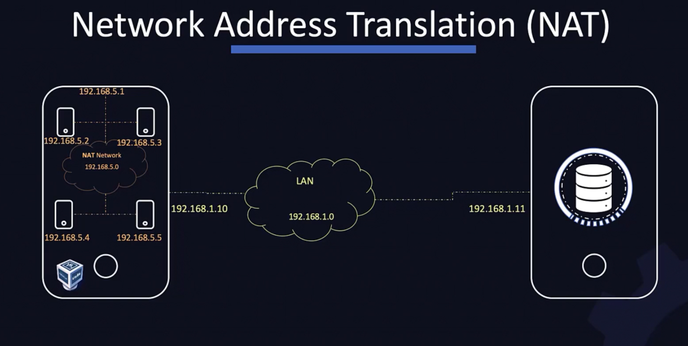
*Photo credit: KodeKloud Ltd.*

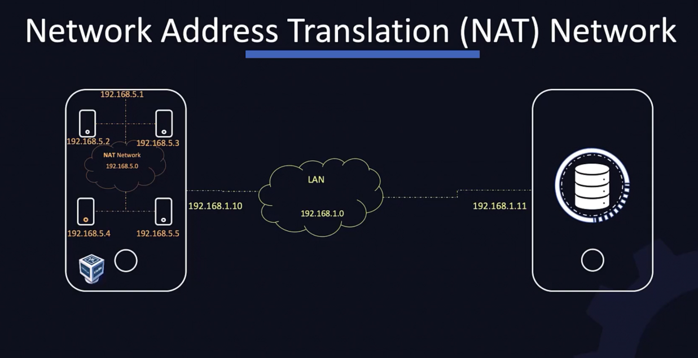
*Photo credit: KodeKloud Ltd.*

### Step B2: Create/verify Host-Only network

1. VirtualBox → **Tools** → **Network**
2. Go to **Host-only Networks**
3. Create or select one (commonly: `vboxnet0`)
4. Set:
   - IPv4 Address: `192.168.56.1`
   - IPv4 Network Mask: `255.255.255.0`
5. DHCP Server:
   - You can keep DHCP enabled OR disable it and use static IPs in Ubuntu.
   - For classroom consistency, we’ll use **static IPs** on the VMs.

Theory:
- Host-only creates a private L2 segment between Windows host and VMs.
- It is ideal for repeatable SSH labs because IPs stay in your controlled subnet.

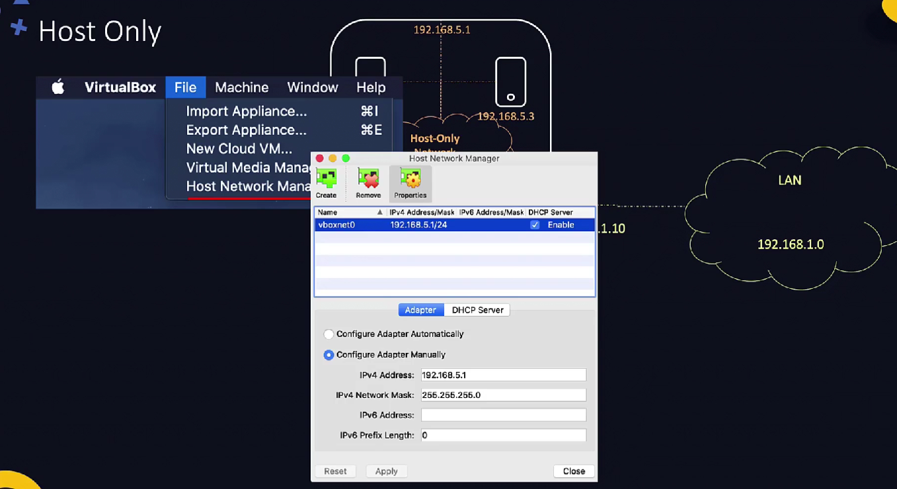
*Photo credit: KodeKloud Ltd.*

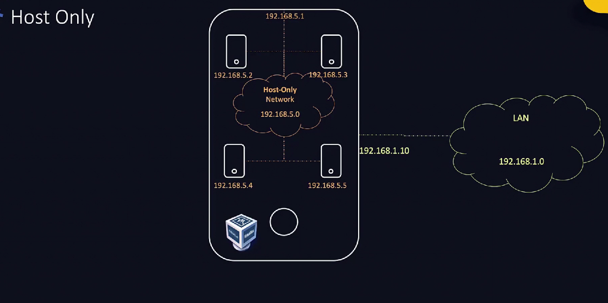
*Photo credit: KodeKloud Ltd.*

## Part C — Create 2 Ubuntu VMs

You can use Ubuntu Desktop or Ubuntu Server.

Recommended for DevOps/Ansible labs:
- **Ubuntu Server LTS** (less GUI, more realistic)

### Step C1: Download Ubuntu ISO

Download:
- Ubuntu Server LTS ISO (22.04 or 24.04 LTS)

### Step C2: Create VM1 (ubuntu-1)

VirtualBox → New:

- Name: `ubuntu-1`
- Type: Linux, Version: Ubuntu (64-bit)
- Memory: 2 GB (minimum); 4 GB recommended if possible
- CPU: 2 cores (if possible)
- Disk: 20 GB (dynamic)

Attach ISO in Storage and start VM to install Ubuntu.

During install:
- Create user (example): `student`
- Enable OpenSSH server (if asked): **Yes**

### Step C3: Create VM2 (ubuntu-2)

Repeat same steps (name `ubuntu-2`).

## Part D — Configure VM networking (2 adapters)

For **each VM**: VirtualBox → VM Settings → Network

### Adapter 1 (Internet)

- Enable Network Adapter
- Attached to: **NAT Network**
- Name: `LabNAT`
- Cable connected: checked

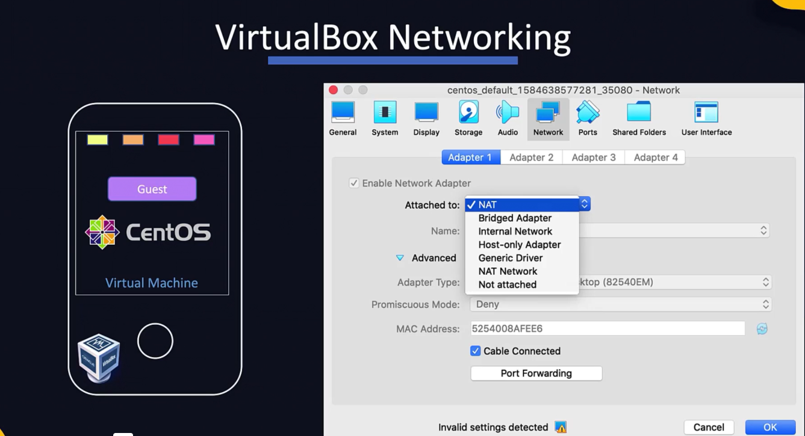
*Photo credit: KodeKloud Ltd.*

### Adapter 2 (Host access)

- Enable Network Adapter
- Attached to: **Host-only Adapter**
- Name: (your host-only, e.g. `vboxnet0`)
- Cable connected: checked

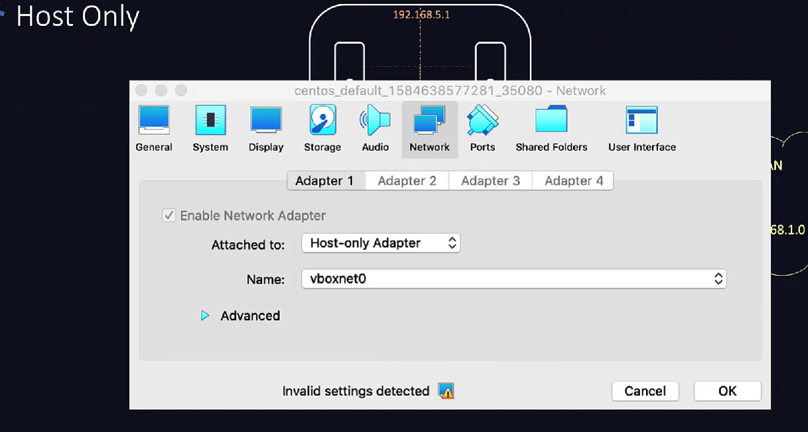
*Photo credit: KodeKloud Ltd.*

Boot both VMs.

## Part E — Configure static IP on Host-Only interface (Ubuntu)

Ubuntu uses **Netplan**. We will set static IP for the host-only NIC.

### Step E1: Identify interfaces

On each VM:

```bash
ip a
```

You will typically see:
- One interface for NAT (DHCP): e.g. `enp0s3`
- One interface for host-only: e.g. `enp0s8`

Theory:
- `ip a` confirms each NIC and its IP assignment.
- You should see one internet-facing/private-NAT address and one host-only lab subnet address.

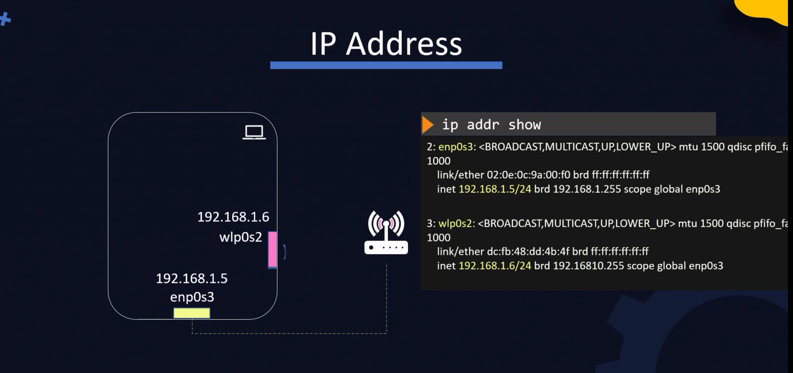
*Photo credit: KodeKloud Ltd.*

### Step E2: Edit netplan

List netplan files:

```bash
ls -l /etc/netplan/
```

Edit the YAML file (example file name may differ):

```bash
sudo nano /etc/netplan/00-installer-config.yaml
```

Example config (adjust interface names):

#### VM1 (ubuntu-1): set `192.168.56.101/24`

```yaml
network:
  version: 2
  renderer: networkd
  ethernets:
    enp0s3:
      dhcp4: true
    enp0s8:
      dhcp4: no
      addresses:
        - 192.168.56.101/24
```

#### VM2 (ubuntu-2): set `192.168.56.102/24`

```yaml
network:
  version: 2
  renderer: networkd
  ethernets:
    enp0s3:
      dhcp4: true
    enp0s8:
      dhcp4: no
      addresses:
        - 192.168.56.102/24
```

Apply:

```bash
sudo netplan apply
```

Verify:

```bash
ip a
ip route
```

## Part F — Install and enable SSH on Ubuntu

If you did not enable OpenSSH during install:

```bash
sudo apt-get update
sudo apt-get install -y openssh-server
sudo systemctl enable --now ssh
sudo systemctl status ssh --no-pager
```

## Part G — Connectivity tests

### Test 1: VM has internet

On each VM:

```bash
ping -c 2 1.1.1.1
ping -c 2 google.com
```

### Test 2: VM ↔ VM over host-only

From VM1:

```bash
ping -c 2 192.168.56.102
```

From VM2:

```bash
ping -c 2 192.168.56.101
```

### Test 3: Windows host ↔ VM ping

On Windows PowerShell:

```powershell
ping 192.168.56.101
ping 192.168.56.102
```

If ping fails but SSH works, that’s still OK (some setups block ICMP). If both fail, troubleshoot.

### NAT packet flow (theory)

When a VM in NAT mode accesses a LAN service, VirtualBox rewrites source addresses:
- VM source IP on NAT subnet is translated before exiting to LAN.
- Return traffic maps back to the originating VM session.

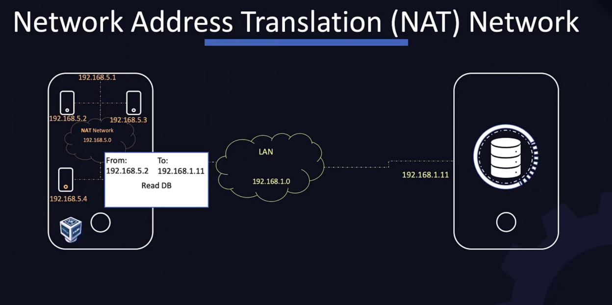
*Photo credit: KodeKloud Ltd.*

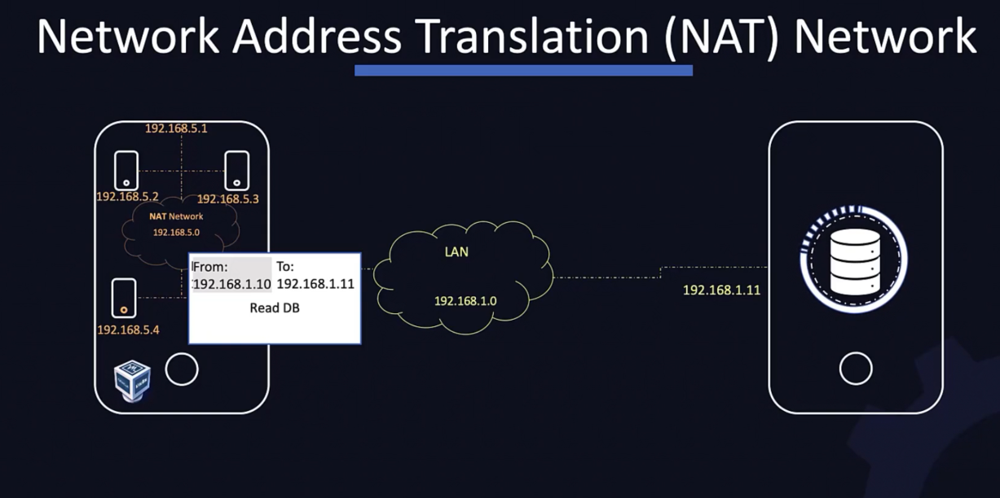
*Photo credit: KodeKloud Ltd.*

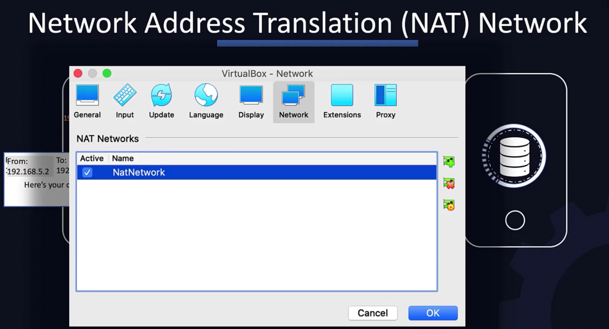
*Photo credit: KodeKloud Ltd.*

## Part H — SSH from Windows host to each VM

### Step H1: Confirm Windows OpenSSH client exists

In PowerShell:

```powershell
ssh -V
```

If not installed:
- Windows Settings → Apps → Optional features → Add a feature → **OpenSSH Client**

### Step H2: SSH into the VMs

```powershell
ssh student@192.168.56.101
ssh student@192.168.56.102
```

### Extra networking theory (optional but useful)

**Bridge mode**:
- VM gets an IP from your real LAN and behaves like another physical device.
- Useful when you want direct LAN visibility, but less isolated than host-only.

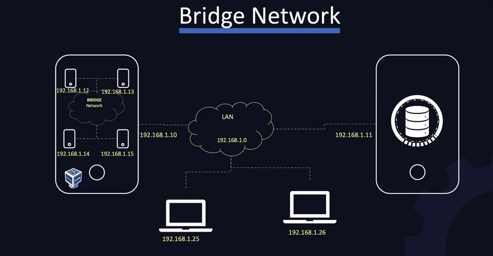
*Photo credit: KodeKloud Ltd.*

**Port forwarding in NAT mode**:
- Lets host reach services inside NAT-only VM by mapping host port -> guest port.
- Example: host port `2222` -> guest SSH port `22`.

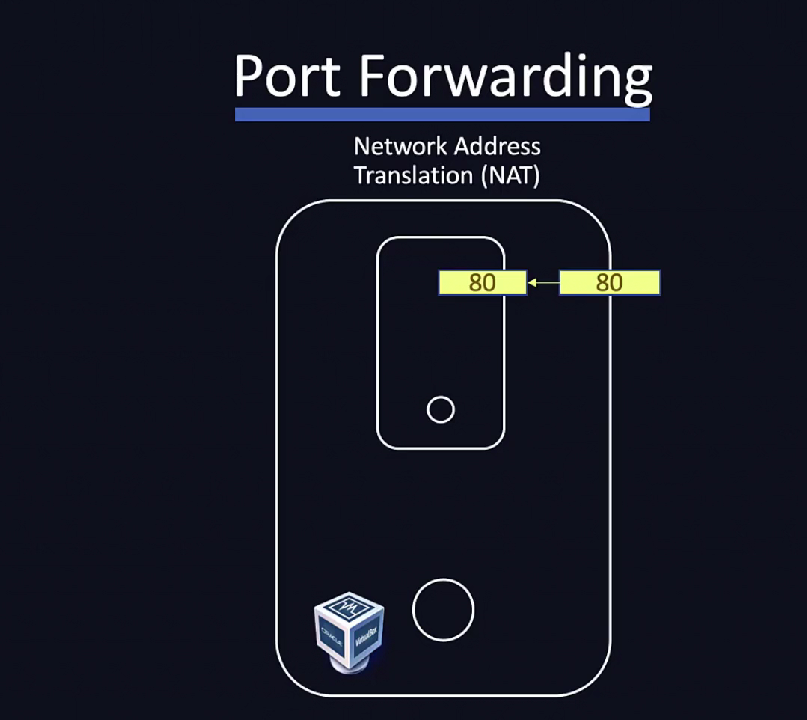
*Photo credit: KodeKloud Ltd.*

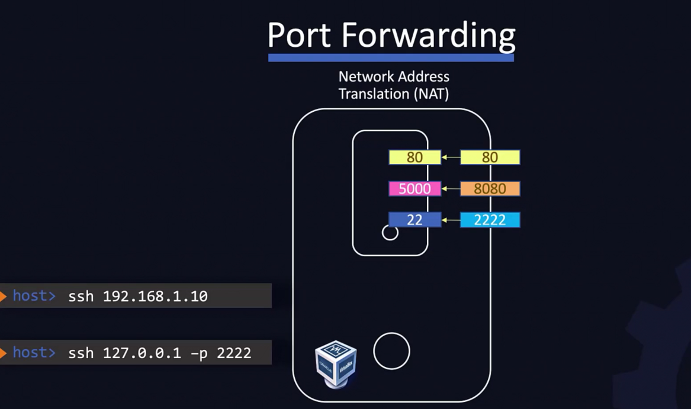
*Photo credit: KodeKloud Ltd.*

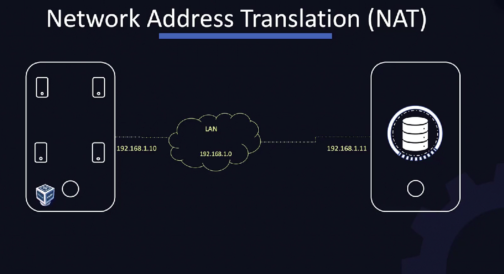
*Photo credit: KodeKloud Ltd.*

## Part I — (Optional) Make VM names resolve via hosts file

On Windows (as admin) edit:
- `C:\Windows\System32\drivers\etc\hosts`

Add:

```text
192.168.56.101 ubuntu-1
192.168.56.102 ubuntu-2
```

Then:

```powershell
ssh student@ubuntu-1
```

## Next step: Use VM1 as Ansible master

If you want to run Ansible inside VirtualBox:
- Install Ansible on `ubuntu-1` and treat `ubuntu-2` as the managed node.
- Or install Ansible on Windows using WSL (more advanced).

See Ansible practice labs:
- `docs/ansible/labs/00-INDEX.md`

